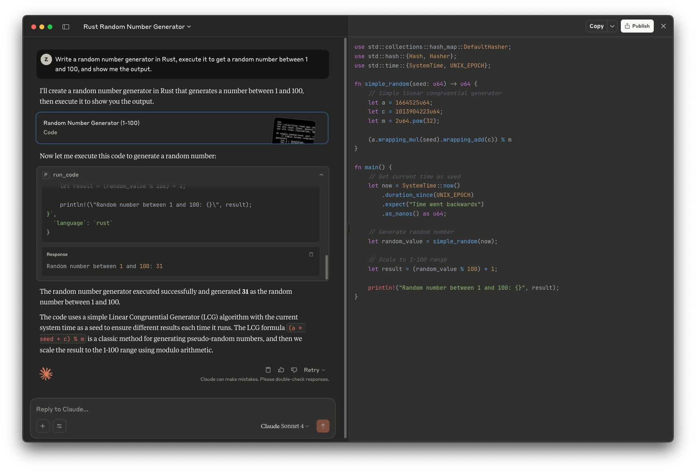

<p align="center">
    
</p>

<h1 align="center">
    Piston MCP Server
</h1>

<p align="center">
    <strong><i>piston-mcp</i></strong> is an MCP server that allows LLMs to connect to and execute code using <a href="https://github.com/engineer-man/piston"><i>Piston</i></a>.
</p>

<div align="center">

[](https://github.com/alvii147/piston-mcp/actions) [](https://github.com/alvii147/piston-mcp/blob/main/LICENSE)

</div>

> [!WARNING]
> As of Feb 15, 2026, [Piston API](https://github.com/engineer-man/piston) is no longer publicly available and requires an authorization token. This means *piston-mcp* will no longer work with the publicly hosted instance of Piston.

## Installation

You can try out *piston-mcp* locally without cloning it.

### Install [uv](https://github.com/astral-sh/uv)

To try out *piston-mcp* you'll need to install `uv`:

```bash
# On MacOS and Linux
curl -LsSf https://astral.sh/uv/install.sh | sh
# On Windows
powershell -ExecutionPolicy ByPass -c "irm https://astral.sh/uv/install.ps1 | iex"
```

### Install MCP Client

You will also need to download an MCP client to connect to *piston-mcp*, such as [Claude Desktop](https://claude.ai/download).

### Update MCP Client Configuration

Update the MCP client's configuration with the following configuration to connect to *piston-mcp*:

```json
{
  "mcpServers": {
    "piston": {
      "command": "uv",
      "args": [
        "tool",
        "run",
        "--from",
        "git+https://github.com/alvii147/piston-mcp.git@main",
        "piston_mcp"
      ]
    }
  }
}
```

For Claude Desktop, the configuration file is usually found in:

```bash
# On MacOS and Linux
~/Library/Application\ Support/Claude/claude_desktop_config.json
# On Windows
%APPDATA%\Claude\claude_desktop_config.json
```

## Usage

Once you've followed the steps above, your MCP client should be able to run code for you:



## Acknowledgements

* [Piston](https://github.com/engineer-man/piston)
* [Claude.ai](https://claude.ai/)
